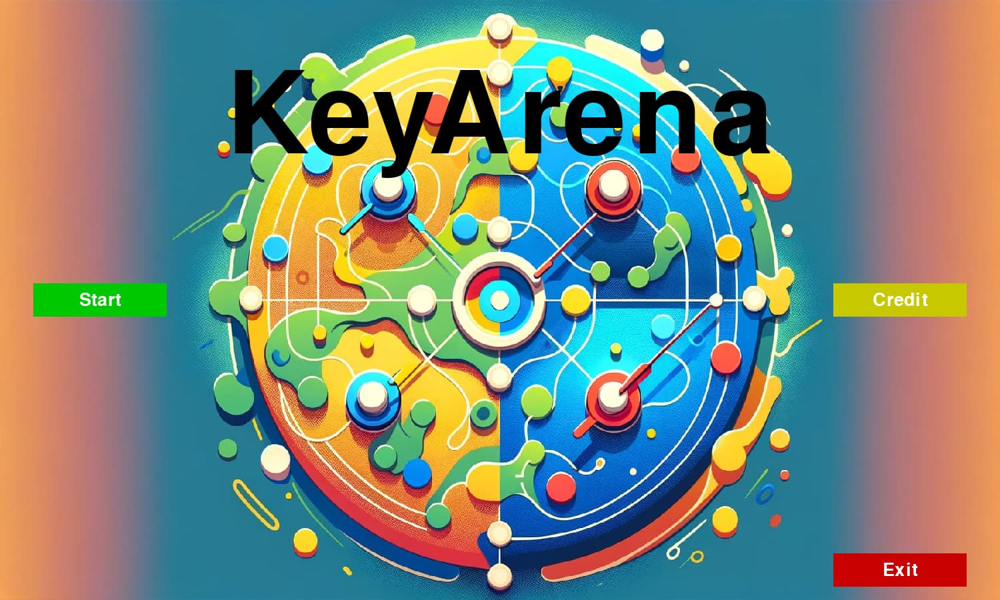
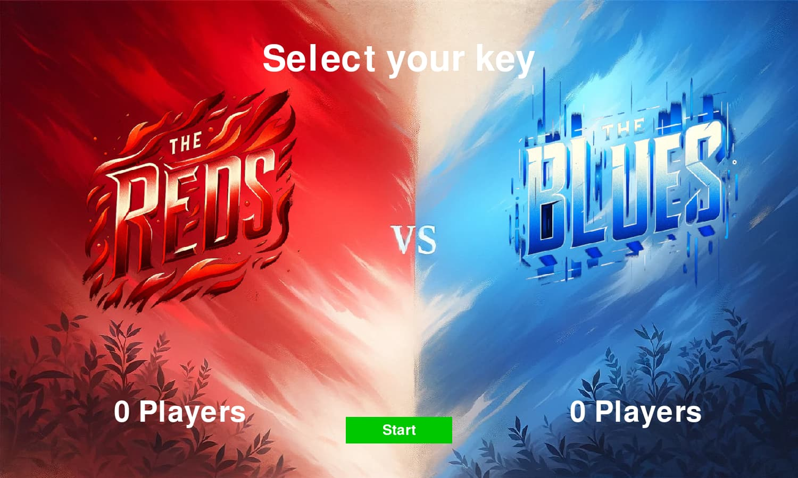

# KeyArena

KeyArena is an innovative 2D massively multiplayer game designed for a single computer. In this dynamic and engaging game, each player commands their own vessel using just a single key. The objective is simple: capture territories on the map for your team and strategically outmaneuver your opponents to claim victory.


Freely inspired from the game [Poggo](https://random-bazar.fr/en/label-2/yojun/) by [Random Bazar](https://random-bazar.fr/en/home-2/).
## Features

- **Unlimited Player Capacity**: The only limit to the number of players in KeyArena is the number of keys on your keyboard.
- **Intense Battle Arena**: Engage in thrilling battles as two teams vie for control over territories. Strategy, skill, and quick reflexes will lead your team to victory.
- **Highly Addictive Gameplay**: With its simple yet challenging mechanics, KeyArena is designed to hook players from the first round.

## Screenshots






## Run Locally

Download or clone the project

```bash
  git clone https://github.com/leon-dav/KeyArena.git
```

Go to the project directory

```bash
  cd KeyArena
```

Install dependencies

```bash
  pip install -r requirements.txt
```

Launch `main.py`

```bash
  python main.py
```

